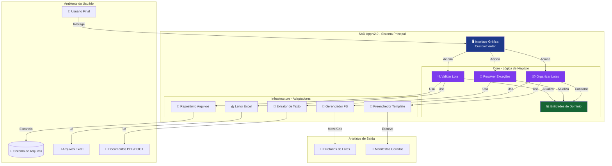

# Mapeamento Sistêmico Integral - SAD App v2.0

**Sistema de Automação de Documentos v2.0**  
**Data da Análise:** 03 de Fevereiro de 2026  
**Analista:** Arquiteto de Soluções Sênior

---

## SEÇÃO 1: Visão Geral da Arquitetura

### 1.1 Padrão Arquitetural Identificado

**Padrão:** Clean Architecture (Arquitetura Limpa) com separação em camadas concêntricas

**Justificativa baseada em evidências:**

1. **Separação explícita de camadas** observada na estrutura de diretórios:
   ```
   src/sad_app_v2/
   ├── core/           # Camada de Domínio e Casos de Uso
   ├── infrastructure/ # Camada de Infraestrutura
   └── presentation/   # Camada de Apresentação
   ```

2. **Inversão de Dependências** implementada através de Protocolos (Interfaces):
   - Arquivo `core/interfaces.py` define contratos abstratos (Protocols)
   - Classes de infraestrutura implementam essas interfaces
   - Core não depende de detalhes de implementação

3. **Entidades de Domínio** puras sem dependências externas:
   - `ManifestItem`: Representação da fonte de verdade (manifesto)
   - `DocumentFile`: Entidade de arquivo físico
   - `DocumentGroup`: Agrupamento de documentos relacionados
   - `OutputLot`: Lote de saída organizado
   - `DocumentStatus`: Enum para estados do documento

4. **Casos de Uso** isolados que orquestram a lógica de negócio:
   - `ValidateBatchUseCase`: UC-01 - Validação de lotes
   - `ResolveUnrecognizedFileUseCase`: UC-02 - Resolução de exceções
   - `OrganizeAndGenerateLotsUseCase`: UC-03 - Organização de lotes

5. **Injeção de Dependências** aplicada consistentemente:
   ```python
   # Exemplo em view_controller.py
   def __init__(self, extractor_service):
       self.extractor_service = extractor_service
   ```

### 1.2 Stack Tecnológico

#### Linguagem Principal
- **Python 3.13+** (configurado em `pyproject.toml`)

#### Framework de Interface
- **CustomTkinter 5.2.2** - Interface gráfica moderna com tema dark
- **Tkinter** (subjacente) - Framework GUI nativo do Python

#### Bibliotecas de Manipulação de Documentos
- **openpyxl 3.1.2** - Leitura e escrita de arquivos Excel (.xlsx)
- **PyPDF2 3.0.1** - Extração de texto de arquivos PDF
- **python-docx 1.1.0** - Manipulação de documentos Word (.docx)

#### Configuração e Dados
- **PyYAML 6.0.1** - Parsing de arquivos de configuração (patterns.yaml)

#### Ferramentas de Build/Distribuição
- **PyInstaller** - Empacotamento em executável standalone
  - Arquivos de especificação: `SAD_App_v2.spec`, `SAD_App_v2_Optimized.spec`
  - Scripts batch de build: `build.bat`, `build_optimized.bat`, `manage_builds.bat`

#### Ferramentas de Desenvolvimento
- **pytest 8.1.1** - Framework de testes
- **ruff 0.1.9** - Linter e formatador de código
- **setuptools** - Gerenciamento de pacotes Python

#### Serviços de Terceiros
**Nenhum serviço externo identificado.** O sistema opera completamente offline, sem dependências de APIs externas, bancos de dados remotos ou serviços cloud.

### 1.3 Diagrama de Contexto (Mermaid)



---

## SEÇÃO 2: Catálogo de Funcionalidades (Feature Map)

### Módulo 1: Validação de Lotes

#### F-001: Carregamento de Manifesto
- **Objetivo:** Importar lista de documentos esperados a partir de arquivo Excel
- **Atores:** Usuário operador do sistema
- **Dependências:**
  - `ExcelManifestRepository` (infrastructure)
  - `openpyxl` (biblioteca externa)
  - Arquivo Excel com estrutura específica (colunas: document_code, revision, title, metadata)
- **Fluxo:** Usuário seleciona arquivo .xlsx → Sistema lê e valida estrutura → Cria objetos `ManifestItem`

#### F-002: Escaneamento de Diretório
- **Objetivo:** Identificar todos os arquivos no diretório de origem recursivamente
- **Atores:** Sistema (automático)
- **Dependências:**
  - `FileSystemFileRepository` (infrastructure)
  - Sistema de arquivos do SO
- **Fluxo:** Sistema recebe caminho → Executa busca recursiva (rglob) → Cria objetos `DocumentFile` com metadados

#### F-003: Validação de Correspondência
- **Objetivo:** Comparar arquivos físicos com itens do manifesto e classificar status
- **Atores:** `ValidateBatchUseCase`
- **Dependências:**
  - F-001 (Manifesto carregado)
  - F-002 (Arquivos escaneados)
  - Lógica de normalização de nomes
- **Fluxo:** 
  - Para cada arquivo: extrai nome base → remove sufixos de revisão → busca no manifesto
  - Classifica como: `VALIDATED`, `NEEDS_SUFFIX`, ou `UNRECOGNIZED`
- **Regra de Negócio RN-NEW-001:** Normalização remove padrões `_[A-Z]$`, `_Rev\d+$`, etc.

#### F-004: Correção Automática de Sufixos
- **Objetivo:** Adicionar sufixo de revisão a arquivos que coincidem com manifesto mas não possuem sufixo
- **Atores:** Usuário (via botão "Tentar Resolver Selecionados")
- **Dependências:**
  - F-003 (Validação executada)
  - `SafeFileRenamer` (infrastructure)
  - Itens com status `NEEDS_SUFFIX`
- **Fluxo:** 
  - Usuário seleciona arquivos → Sistema verifica `associated_manifest_item` → Adiciona sufixo `_[REVISÃO]` ao nome
  - Realiza renomeação segura com verificação de conflitos

### Módulo 2: Resolução de Exceções (RIR)

#### F-005: Extração de Código de Documento
- **Objetivo:** Extrair código de documento a partir do conteúdo textual do arquivo
- **Atores:** `ResolveUnrecognizedFileUseCase`
- **Dependências:**
  - `ProfiledExtractorService` (infrastructure)
  - `config/patterns.yaml` (configuração de padrões regex)
  - Bibliotecas: PyPDF2 (PDF), python-docx (DOCX)
- **Fluxo:**
  - Sistema identifica tipo de arquivo → Extrai texto completo → Aplica padrões regex do perfil RIR
  - Padrões configurados em YAML:
    ```yaml
    RIR:
      patterns:
        - 'Relatório:\s*([A-Z0-9_\.\-\s]+?)(?:\s*-|\s*$|\r|\n)'
        - 'Código:\s*([A-Z0-9_\.\-]+)'
        - '([A-Z0-9]+_[A-Z0-9]+_[A-Z0-9]+_[\d\.]+_[A-Z]+_RIR_[A-Z0-9\-]+)'
    ```

#### F-006: Validação de Código Extraído
- **Objetivo:** Verificar se código extraído existe no manifesto carregado
- **Atores:** `ResolveUnrecognizedFileUseCase`
- **Dependências:**
  - F-005 (Código extraído)
  - F-001 (Manifesto carregado)
  - Lógica de sanitização (remove sufixos)
- **Fluxo:** Código extraído → Sanitização → Busca no mapa do manifesto → Atualiza status do arquivo

#### F-007: Renomeação Inteligente
- **Objetivo:** Renomear arquivo não reconhecido usando código extraído + sufixo
- **Atores:** Sistema (após validação bem-sucedida)
- **Dependências:**
  - F-006 (Código validado)
  - `SafeFileRenamer.safe_rename_file()`
- **Fluxo:**
  - Construir novo nome: `[código_extraído]_[revisão].[extensão]`
  - Verificar conflitos de nome
  - Executar renomeação com geração de nome único se necessário (sufixo numérico)

### Módulo 3: Organização e Geração de Lotes

#### F-008: Agrupamento de Documentos
- **Objetivo:** Agrupar arquivos validados pelo mesmo `document_code`
- **Atores:** `OrganizeAndGenerateLotsUseCase`
- **Dependências:**
  - F-003 (Arquivos validados)
  - Entidade `DocumentGroup`
- **Fluxo:** Itera arquivos validados → Cria/atualiza dicionário de grupos por código → Retorna lista de `DocumentGroup`

#### F-009: Balanceamento de Lotes
- **Objetivo:** Distribuir grupos de documentos em lotes balanceados por tamanho
- **Atores:** `GreedyLotBalancerService`
- **Dependências:**
  - F-008 (Grupos criados)
  - Parâmetro `max_docs_per_lot`
- **Fluxo (Algoritmo Guloso):**
  1. Ordena grupos por tamanho total (bytes) decrescente
  2. Calcula número de lotes necessários: `ceil(total_grupos / max_docs_per_lot)`
  3. Para cada grupo: adiciona ao lote com menor tamanho acumulado
- **Resultado:** Lista de `OutputLot` com distribuição equilibrada

#### F-010: Criação de Estrutura de Diretórios
- **Objetivo:** Criar diretórios para cada lote seguindo padrão de nomenclatura
- **Atores:** `SafeFileSystemManager`
- **Dependências:**
  - F-009 (Lotes definidos)
  - Parâmetros: `output_directory`, `lot_name_pattern`, `start_sequence_number`
- **Fluxo:** 
  - Para cada lote: substitui `XXXX` no padrão por número sequencial (formato `{seq:04d}`)
  - Cria diretório: `output_directory / lot_name`
  - Exemplo: `0130869-CZ6-PGV-G-0001-2025-eGRDT`

#### F-011: Movimentação de Arquivos
- **Objetivo:** Mover arquivos validados para diretórios de lote com nome correto
- **Atores:** `SafeFileSystemManager.move_file()`
- **Dependências:**
  - F-010 (Estrutura criada)
  - Função `get_filename_with_revision()`
- **Fluxo:**
  - Para cada arquivo no grupo: construir nome com revisão → mover para diretório do lote
  - Usa `shutil.move()` com tratamento de erros robusto

#### F-012: Preenchimento de Template Excel
- **Objetivo:** Gerar manifesto Excel para cada lote baseado em template mestre
- **Atores:** `OpenpyxlTemplateFiller`
- **Dependências:**
  - F-010 (Estrutura criada)
  - Arquivo template mestre (.xlsx)
  - `openpyxl` para manipulação
- **Fluxo:**
  1. Copia template para diretório do lote
  2. Localiza linha de inserção (após cabeçalho, antes de "FIM")
  3. Para cada grupo no lote: insere linha com dados (código, revisão, título, nome arquivo, etc.)
  4. Aplica formatação (fontes, bordas, alinhamento, larguras de coluna)
  5. Salva arquivo como `[lot_name].xlsx`
- **Detalhes de Formatação:**
  - Cabeçalho: fundo amarelo (`#FFFF00`), negrito, centralizado
  - Dados: alinhamento à esquerda, bordas finas
  - Larguras de coluna predefinidas (A=35, B=10, C=60, etc.)

### Módulo 4: Interface Gráfica

#### F-013: Sistema de Navegação por Abas
- **Objetivo:** Separar fluxos de trabalho em abas distintas
- **Atores:** Usuário
- **Dependências:**
  - `CTkTabview` (CustomTkinter)
- **Estrutura:**
  - **Aba 1:** "1. Validação e Resolução"
    - Lista de arquivos validados (readonly textbox)
    - Lista de não reconhecidos (scrollable frame com checkboxes)
    - Painel de resolução (combobox de perfis + botão resolver)
  - **Aba 2:** "2. Organização e Saída"
    - Formulário de configuração (diretório saída, template, parâmetros numéricos, padrão nomenclatura)

#### F-014: Sistema de Seleção Múltipla
- **Objetivo:** Permitir seleção de múltiplos arquivos não reconhecidos para processamento em lote
- **Atores:** Usuário
- **Dependências:**
  - Dicionário `unrecognized_checkboxes` mantido pela view
- **Funcionalidades:**
  - Botão "Selecionar Todos"
  - Botão "Desmarcar Todos"
  - Checkboxes individuais para cada arquivo

#### F-015: Sistema de Logs e Feedback
- **Objetivo:** Fornecer feedback em tempo real sobre operações do sistema
- **Atores:** Sistema (gerado automaticamente)
- **Dependências:**
  - `CTkTextbox` para área de log
  - `CTkProgressBar` para operações longas
- **Tipos de Mensagens:**
  - Informativas (prefixo vazio ou ℹ️)
  - Avisos (prefixo ⚠️)
  - Sucessos (prefixo ✅)
  - Erros (prefixo ❌)
  - Processamento (prefixo 🔄)

#### F-016: Execução Assíncrona
- **Objetivo:** Manter interface responsiva durante operações pesadas
- **Atores:** `ViewController`
- **Dependências:**
  - `threading.Thread` (Python stdlib)
  - Método `view.after()` para atualização thread-safe da UI
- **Operações Assíncronas:**
  - Validação de lote (`_run_validation`)
  - Resolução RIR (`_run_rir_resolution`)
  - Organização de lotes (`_run_organization`)
- **Padrão Implementado:**
  ```python
  def on_action_click(self):
      self._set_ui_busy(True, "Processando...")
      threading.Thread(target=self._run_action, daemon=True).start()
  
  def _run_action(self):
      try:
          # Lógica pesada
          result = use_case.execute(...)
          self.view.after(0, self._update_ui, result)
      finally:
          self.view.after(0, self._set_ui_busy, False, "AÇÃO")
  ```

#### F-017: Gestão de Estado da Interface
- **Objetivo:** Controlar habilitação/desabilitação de botões baseado em pré-condições
- **Atores:** `ViewController`
- **Dependências:** Estado da aplicação (caminhos selecionados, resultados de validação)
- **Regras de Estado:**
  - Botão "ORGANIZAR E GERAR LOTES": desabilitado até validação bem-sucedida
  - Painel de resolução: desabilitado se não há arquivos não reconhecidos
  - Botões de seleção de arquivo: sempre habilitados
  - Durante processamento: interface marcada como "busy"

### Módulo 5: Operações de Arquivo Seguras

#### F-018: Renomeação Segura com Verificações
- **Objetivo:** Renomear arquivos com múltiplas camadas de verificação
- **Atores:** `SafeFileRenamer.safe_rename_file()`
- **Dependências:**
  - Sistema de arquivos
  - Verificações de permissão
- **Verificações Implementadas:**
  1. Arquivo origem existe e é arquivo regular
  2. Permissões de escrita no diretório origem
  3. Permissões de escrita no diretório destino
  4. Conflito de nome (gera nome único se necessário)
  5. Backup/rollback em caso de falha (implementação indicada mas não visível no trecho)

#### F-019: Geração de Nomes Únicos
- **Objetivo:** Evitar sobrescrita de arquivos existentes
- **Atores:** `SafeFileRenamer._generate_unique_filename()`
- **Dependências:** Sistema de arquivos
- **Fluxo:**
  1. Verifica se caminho destino existe
  2. Se não existe: retorna caminho original
  3. Se existe: tenta sufixos numéricos `_001`, `_002`, ... até `_1000`
  4. Se todos ocupados: usa timestamp Unix como sufixo final

---

## SEÇÃO 3: Fluxo de Dados e Entidades

### 3.1 Entidades Principais

#### ManifestItem
```python
@dataclass
class ManifestItem:
    document_code: str      # Identificador único do documento
    revision: str           # Versão/revisão (ex: "A", "0", "B")
    title: str              # Título descritivo do documento
    metadata: Dict[str, Any]  # Campos adicionais do Excel (flexível)
```
**Papel:** Fonte da verdade. Representa o que DEVERIA existir segundo o manifesto.

#### DocumentFile
```python
@dataclass
class DocumentFile:
    path: Path                              # Localização física
    size_bytes: int                         # Tamanho em bytes
    status: DocumentStatus                  # Estado atual do arquivo
    associated_manifest_item: Optional[ManifestItem]  # Link com manifesto
```
**Papel:** Representação do que EXISTE fisicamente. Conecta mundo físico ao domínio.

**Estados Possíveis (DocumentStatus):**
- `UNVALIDATED`: Estado inicial, não processado
- `VALIDATED`: Corresponde ao manifesto e tem sufixo correto
- `NEEDS_SUFFIX`: Corresponde ao manifesto mas falta sufixo de revisão
- `UNRECOGNIZED`: Não encontrado no manifesto
- `RECOGNIZED`: Renomeado mas sem correspondência no manifesto (cenário raro)
- `ERROR`: Erro durante processamento

#### DocumentGroup
```python
@dataclass
class DocumentGroup:
    document_code: str              # Código de agrupamento
    files: List[DocumentFile]       # Arquivos relacionados
    @property total_size_bytes: int  # Tamanho total calculado
```
**Papel:** Agrupa documentos relacionados (mesmo código) para organização em lotes. Usado para balanceamento.

#### OutputLot
```python
@dataclass
class OutputLot:
    lot_name: str                       # Nome do lote gerado
    groups: List[DocumentGroup]         # Grupos incluídos
    @property files: List[DocumentFile]  # Todos os arquivos (flat)
    @property total_size_bytes: int      # Tamanho total do lote
```
**Papel:** Representa um lote de saída completo. Mantém compatibilidade com código legado via propriedade `files`.

#### OrganizationResult
```python
@dataclass
class OrganizationResult:
    lots_created: int = 0
    files_moved: int = 0
    success: bool = True
    message: str = "Operação concluída com sucesso."
```
**Papel:** DTO (Data Transfer Object) para reportar resultado de operações de organização.

### 3.2 Ciclo de Vida Crítico: Do Input Manual até Lote Organizado

**Fluxo Completo Mais Complexo do Sistema:**

```
[INÍCIO] Usuário Inicia Aplicação
    ↓
[PASSO 1] SELEÇÃO DE INPUTS
    Usuário seleciona:
    - Manifesto Excel: c:/documentos/manifesto.xlsx
    - Diretório Origem: c:/documentos/arquivos_brutos/
    ↓
[PASSO 2] CLIQUE EM "VALIDAR LOTE"
    ↓
    ViewController.on_validate_batch_click()
    → Cria thread assíncrona
    → Chama _run_validation()
    ↓
[PASSO 3] CARREGAMENTO DO MANIFESTO
    ExcelManifestRepository.load_from_file()
    → openpyxl.load_workbook(manifesto.xlsx)
    → Para cada linha (min_row=2):
        ↳ Cria ManifestItem(code, revision, title, metadata)
    → Retorna: List[ManifestItem] (150 itens, por exemplo)
    ↓
[PASSO 4] ESCANEAMENTO DE ARQUIVOS
    FileSystemFileRepository.list_files()
    → directory.rglob('*')  # Busca recursiva
    → Para cada Path encontrado:
        ↳ Se é arquivo: cria DocumentFile(path, size_bytes, status=UNVALIDATED)
    → Retorna: List[DocumentFile] (180 arquivos, por exemplo)
    ↓
[PASSO 5] VALIDAÇÃO E CASAMENTO
    ValidateBatchUseCase.execute()
    → Cria manifest_map: {code: ManifestItem}
    → Para cada DocumentFile:
        A. Extrai base_name = _get_file_base_name(file.path.name)
           Exemplo: "DOC-123_Rev0.pdf" → "DOC-123"
        B. Compara stem com base_name:
           has_suffix = (stem != base_name)
        C. Busca matched_item = manifest_map.get(base_name)
        D. Classificação:
           ├─ Se matched_item E has_suffix:
           │   → status = VALIDATED
           │   → associated_manifest_item = matched_item
           │   → Adiciona a validated_files
           ├─ Se matched_item E NÃO has_suffix:
           │   → status = NEEDS_SUFFIX
           │   → associated_manifest_item = matched_item
           │   → Adiciona a unrecognized_files
           └─ Se NÃO matched_item:
               → status = UNRECOGNIZED
               → Adiciona a unrecognized_files
    → Retorna: (validated_files: 145, unrecognized_files: 35)
    ↓
[PASSO 6] ATUALIZAÇÃO DA UI (thread-safe)
    view.after(0, _update_ui_lists)
    → update_validated_list(): exibe 145 arquivos em textbox
    → update_unrecognized_list(): cria 35 checkboxes em scrollable frame
    → Habilita painel de resolução
    → Exibe log: "Validação concluída: 145 válidos, 35 não reconhecidos."
    ↓
[PASSO 7] RESOLUÇÃO MANUAL (OPCIONAL)
    Usuário seleciona 10 arquivos não reconhecidos
    → Clica "Tentar Resolver Selecionados"
    → Para cada arquivo selecionado:
        ViewController._run_rir_resolution(file)  # Thread separada
        ↓
        A. Verifica status:
           ├─ Se NEEDS_SUFFIX:
           │   → Obtém revision do associated_manifest_item
           │   → new_name = f"{stem}_{revision}{extension}"
           │   → SafeFileRenamer.safe_rename_file(old_path, new_path)
           │   → Atualiza status para VALIDATED
           │   → Move de unrecognized para validated
           └─ Se UNRECOGNIZED:
               ↓
               ResolveUnrecognizedFileUseCase.execute()
               B1. ProfiledExtractorService.extract_text(file)
                   → Se .pdf: PyPDF2.PdfReader → extrai texto de todas páginas
                   → Se .docx: python-docx.Document → concatena parágrafos
                   → Retorna: texto completo (string)
               B2. ProfiledExtractorService.find_code(text, "RIR")
                   → Carrega patterns do YAML:
                      'Relatório:\s*([A-Z0-9_\.\-\s]+?)(?:\s*-|\s*$|\r|\n)'
                   → Executa re.search() com IGNORECASE | MULTILINE
                   → Retorna: código encontrado (ex: "CZ6_RNEST_U22_3.1.1.1_ELE_RIR_ELE-700")
               B3. _sanitize_code(código)
                   → Remove sufixos: re.sub(r'_[A-Z0-9]$', '', code)
                   → Retorna: código limpo
               B4. Busca em manifest_map
                   ├─ Se encontrado:
                   │   → Atualiza status para VALIDATED
                   │   → Atualiza associated_manifest_item
                   │   → Renomeia arquivo: SafeFileRenamer.safe_rename_file()
                   │   → Move de unrecognized para validated
                   └─ Se NÃO encontrado:
                       → Lança CodeNotInManifestError
                       → Exibe erro no log
    → Resultado: 8 resolvidos com sucesso, 2 com erro
    → Totais atualizados: validated_files: 153, unrecognized_files: 27
    ↓
[PASSO 8] CONFIGURAÇÃO DE ORGANIZAÇÃO
    Usuário preenche aba "2. Organização e Saída":
    - Pasta Destino: c:/saida/
    - Template: c:/templates/template_manifesto.xlsx
    - Máx. Documentos por Lote: 50
    - Nº Sequencial Inicial: 1
    - Padrão: "0130869-CZ6-PGV-G-XXXX-2025-eGRDT"
    ↓
[PASSO 9] CLIQUE EM "ORGANIZAR E GERAR LOTES"
    ViewController.on_organize_lots_click()
    → Validações:
        ├─ Verifica se validated_files não está vazio
        ├─ Verifica se todos os caminhos estão selecionados
        ├─ Valida max_docs_per_lot > 0
        └─ Valida start_sequence_number >= 0
    → Cria thread assíncrona
    → Chama _run_organization()
    ↓
[PASSO 10] AGRUPAMENTO
    OrganizeAndGenerateLotsUseCase.execute()
    → Validação inicial: verifica se todos arquivos existem fisicamente
    → groups_map: Dict[str, DocumentGroup] = {}
    → Para cada file em validated_files (153 arquivos):
        code = file.associated_manifest_item.document_code
        Se code não em groups_map:
            groups_map[code] = DocumentGroup(code)
        groups_map[code].files.append(file)
    → groups = list(groups_map.values())  # 120 grupos
    ↓
[PASSO 11] BALANCEAMENTO
    GreedyLotBalancerService.balance_lots(groups, max_docs=50)
    → sorted_groups = sorted(groups, key=λ g: sum(f.size_bytes), reverse=True)
       (Ordena do maior para o menor em bytes)
    → num_lots = ceil(120 / 50) = 3 lotes
    → Inicializa: lots = [OutputLot("Lote_1"), OutputLot("Lote_2"), OutputLot("Lote_3")]
    → Para cada group em sorted_groups:
        ├─ lightest_lot = min(lots, key=λ lot: lot.total_size_bytes)
        └─ lightest_lot.groups.append(group)
    → Retorna: [OutputLot("Lote_1", 40 grupos), OutputLot("Lote_2", 40 grupos), OutputLot("Lote_3", 40 grupos)]
    ↓
[PASSO 12] CRIAÇÃO DE ESTRUTURA
    Para i, lot em enumerate(output_lots):
        seq_number = 1 + i  # 1, 2, 3
        lot_name = "0130869-CZ6-PGV-G-XXXX-2025-eGRDT".replace("XXXX", f"{seq_number:04d}")
        # Resultados: 
        #   "0130869-CZ6-PGV-G-0001-2025-eGRDT"
        #   "0130869-CZ6-PGV-G-0002-2025-eGRDT"
        #   "0130869-CZ6-PGV-G-0003-2025-eGRDT"
        ↓
        lot_directory = c:/saida/0130869-CZ6-PGV-G-0001-2025-eGRDT/
        SafeFileSystemManager.create_directory(lot_directory)
        → lot_directory.mkdir(parents=True, exist_ok=True)
    ↓
[PASSO 13] MOVIMENTAÇÃO DE ARQUIVOS
        Para cada group em lot.groups:
            Para cada file em group.files:
                revision = file.associated_manifest_item.revision
                new_filename = get_filename_with_revision(file.path.name, revision)
                # Exemplo: "DOC-123.pdf" + "A" → "DOC-123_A.pdf"
                destination = lot_directory / new_filename
                SafeFileSystemManager.move_file(file.path, destination)
                → destination.parent.mkdir(parents=True, exist_ok=True)
                → shutil.move(str(source), str(destination))
                files_moved_count += 1
    ↓
[PASSO 14] PREENCHIMENTO DE MANIFESTO
        output_manifest = lot_directory / "0130869-CZ6-PGV-G-0001-2025-eGRDT.xlsx"
        OpenpyxlTemplateFiller.fill_and_save(template, output_manifest, lot.groups)
        ↓
        A. SafeFileSystemManager.copy_file(template, output_manifest)
        B. workbook = openpyxl.load_workbook(output_manifest)
           sheet = workbook.active
        C. Localiza header_row (primeira linha) e insert_row (próxima linha válida)
        D. Para cada group em lot.groups:
             Para cada file em group.files:
                 sheet.insert_rows(insert_row)
                 Preenche células:
                 ├─ A: document_code
                 ├─ B: revision
                 ├─ C: title
                 ├─ D: filename (com revisão)
                 ├─ E: extensão
                 └─ F-I: metadados adicionais
                 insert_row += 1
        E. _apply_header_formatting(sheet, header_row, num_columns)
           → Fundo amarelo, negrito, centralizado
        F. _apply_data_formatting(sheet, start_row, end_row, num_columns)
           → Bordas, alinhamento
        G. _adjust_column_widths(sheet)
           → A=35, B=10, C=60, D=35, E=10, F=20, G=20, H=20, I=20
        H. workbook.save(output_manifest)
    ↓
[PASSO 15] RESULTADO E FEEDBACK
    OrganizationResult(lots_created=3, files_moved=153, success=True)
    ↓
    view.after(0, _show_organization_result, result)
    → messagebox.showinfo(
        "Organização Concluída",
        "3 lotes criados\n153 arquivos movidos\nManifestos gerados com sucesso"
      )
    → Adiciona ao log: "✅ Operação concluída com sucesso"
    ↓
[FIM] Usuário Pode Fechar Aplicação ou Iniciar Novo Ciclo
```

**Transformações de Dados Chave:**
1. **Excel → ManifestItem:** Estrutura tabular → Objetos de domínio
2. **Path → DocumentFile:** Metadados do SO → Entidade rastreável
3. **Texto Bruto → Código Limpo:** Extração regex + sanitização
4. **DocumentFile → DocumentGroup:** Agregação por código
5. **DocumentGroup → OutputLot:** Distribuição balanceada
6. **OutputLot → Diretórios + Manifestos:** Materialização física

---

## SEÇÃO 4: Análise de Integridade e Lacunas

### 4.1 Pontos de Falha Potenciais

#### 🔴 CRÍTICO: Ausência de Transação Atômica em Organização
**Localização:** `OrganizeAndGenerateLotsUseCase.execute()` (organize_lots.py)

**Problema:**
O processo de organização realiza múltiplas operações irreversíveis (movimentação de arquivos) sem mecanismo de rollback. Se uma falha ocorrer no meio do processo:
- Arquivos já movidos permanecerão nos novos diretórios
- Arquivos não movidos permanecerão no diretório original
- Estado inconsistente sem forma automática de recuperação

**Cenários de Risco:**
1. Falha de permissão no meio da movimentação
2. Disco cheio durante cópia de arquivo grande
3. Interrupção do processo pelo usuário (Ctrl+C)
4. Crash da aplicação durante movimentação

**Evidência:**
```python
# organize_lots.py, linha ~110
for group in lot.groups:
    for file in group.files:
        # ... 
        self._file_manager.move_file(file.path, destination_path)
        files_moved_count += 1
        # ❌ Sem checkpoint ou possibilidade de rollback
```

**Mitigação Recomendada:**
- Implementar modo "dry-run" com validação completa antes de mover arquivos
- Criar arquivo de log de operações para permitir rollback manual
- Considerar abordagem: copiar → validar → deletar origem (em vez de mover diretamente)

#### 🟠 ALTO: Extração de Texto de PDF Frágil
**Localização:** `ProfiledExtractorService._extract_text_from_pdf()` (extraction.py)

**Problema:**
Uso de `PyPDF2` sem tratamento para PDFs problemáticos:
- PDFs escaneados (imagens sem OCR)
- PDFs com texto incorporado como imagem
- PDFs corrompidos ou com proteção
- PDFs com encoding não-padrão

**Evidência:**
```python
def _extract_text_from_pdf(self, file_path: Path) -> str:
    text = ""
    with open(file_path, "rb") as f:
        reader = PdfReader(f)
        for page in reader.pages:
            text += page.extract_text() or ""
    return text
    # ❌ Sem tratamento para PDFs de imagem ou corrompidos
```

**Impacto:**
Resolução RIR falhará silenciosamente para esses PDFs, retornando string vazia → código não encontrado.

**Mitigação Recomendada:**
- Adicionar detecção de PDFs escaneados (verificar se texto extraído < X caracteres)
- Implementar fallback para OCR (pytesseract) em caso de extração vazia
- Adicionar logging explícito quando extração retorna vazio

#### 🟠 ALTO: Hardcoding de Estrutura de Manifesto Excel
**Localização:** `ExcelManifestRepository.load_from_file()` (excel_reader.py)

**Problema:**
Mapeamento de colunas fixo sem validação de estrutura:
```python
document_code = row[0]  # Assume coluna A
revision = str(row[1])   # Assume coluna B
title = row[2]           # Assume coluna C
# ❌ Sem verificação se colunas existem ou se são do tipo esperado
```

**Cenários de Risco:**
1. Template Excel alterado por usuário (troca ordem de colunas)
2. Manifesto com colunas faltando
3. Valores None em células obrigatórias

**Impacto:**
- IndexError se manifesto tiver menos de 3 colunas
- Dados incorretos se ordem de colunas for diferente
- Atribuição de None para campos críticos

**Mitigação Recomendada:**
- Validar cabeçalho (linha 1) contra esquema esperado
- Usar nomes de colunas em vez de índices
- Adicionar verificação de campos obrigatórios não-vazios

#### 🟡 MÉDIO: Ausência de Limite de Memória em Listagem de Arquivos
**Localização:** `FileSystemFileRepository.list_files()` (file_system.py)

**Problema:**
Busca recursiva sem limite ou paginação:
```python
def list_files(self, directory: Path) -> List[DocumentFile]:
    found_files: List[DocumentFile] = []
    for path in directory.rglob("*"):  # ❌ Carrega tudo na memória
        if path.is_file():
            found_files.append(DocumentFile(path=path, size_bytes=path.stat().st_size))
    return found_files
```

**Cenários de Risco:**
- Diretórios com dezenas de milhares de arquivos
- Estruturas aninhadas muito profundas
- Arquivos em rede com alta latência

**Impacto:**
- Consumo excessivo de memória
- Interface travada durante escaneamento longo
- Timeout em diretórios muito grandes

**Mitigação Recomendada:**
- Implementar gerador (yield) em vez de lista completa
- Adicionar barra de progresso para escaneamento
- Considerar limite configurável de arquivos máximos

#### 🟡 MÉDIO: Falta de Validação de Permissões Antes de Operações
**Localização:** Múltiplas classes de infraestrutura

**Problema:**
Verificações de permissão só ocorrem durante execução real, não na validação inicial:
```python
# SafeFileSystemManager.move_file() só verifica permissão ao executar
def move_file(self, source: Path, destination: Path) -> None:
    try:
        destination.parent.mkdir(parents=True, exist_ok=True)
        shutil.move(str(source), str(destination))
    except (FileNotFoundError, shutil.Error, OSError, PermissionError) as e:
        raise FileSystemOperationError(...)
    # ❌ Sem validação prévia de permissões
```

**Impacto:**
Falhas descobertas apenas no meio do processo, após já ter movido alguns arquivos.

**Mitigação Recomendada:**
- Adicionar método `validate_permissions()` que executa antes do processamento
- Verificar permissões de leitura/escrita em todos os diretórios envolvidos
- Reportar problemas de permissão na fase de validação, não durante execução

#### 🟡 MÉDIO: Tratamento de Encoding Não Explícito
**Localização:** Leitura de arquivos YAML e potencialmente outros textos

**Problema:**
Algumas operações de arquivo especificam encoding, outras não:
```python
# extraction.py - BOM
with open(config_path, "r", encoding="utf-8") as f:
    return yaml.safe_load(f).get("profiles", {})

# file_system.py - Sem encoding explícito em shutil.move()
# Pode causar problemas com nomes de arquivo com caracteres especiais
```

**Impacto:**
- Falhas em sistemas com locale não-UTF-8
- Problemas com caracteres acentuados em nomes de arquivo

**Mitigação Recomendada:**
- Padronizar encoding="utf-8" em todas operações de texto
- Adicionar tratamento explícito para nomes de arquivo com Unicode

### 4.2 Dívida Técnica Visível

#### 📝 Compatibilidade Retroativa Desnecessária
**Localização:** `DocumentFile` (domain.py, linhas 30-45)

**Evidência:**
```python
@dataclass
class DocumentFile:
    # ...
    associated_manifest_item: Optional[ManifestItem] = None
    _manifest_item: Optional[ManifestItem] = None  # ❌ Campo duplicado

    @property
    def manifest_item(self):
        """Getter para manter compatibilidade com código legado."""
        return self.associated_manifest_item

    @manifest_item.setter
    def manifest_item(self, value):
        """Setter que atualiza ambos os campos para manter compatibilidade."""
        self.associated_manifest_item = value
        self._manifest_item = value  # ❌ Sincronização manual
```

**Problema:**
- Duplicação de estado
- Sincronização manual propensa a bugs
- Comentário indica "código legado" mas não há plano de remoção

**Ação Recomendada:**
- Identificar e refatorar código que usa `manifest_item` antigo
- Remover campo `_manifest_item` e propriedade de compatibilidade
- Atualizar todos os usos para `associated_manifest_item` consistentemente

#### 📝 Comentário Indicando Funcionalidade Não Implementada
**Localização:** `controller.py` (linha 257)

**Evidência:**
```python
def on_some_action(self):
    """
    TODO: Implementar em versão futura.
    """
    pass
```

**Problema:**
Método stub no código de produção sem marcação de "não implementado" para o usuário.

**Ação Recomendada:**
- Se não será implementado: remover
- Se será implementado: criar issue/ticket e adicionar `raise NotImplementedError()`

#### 📝 Padrão de Nomenclatura de Lote Hardcoded
**Localização:** `main_view.py` (linha ~213)

**Evidência:**
```python
self.lot_pattern_entry.insert(0, "0130869-CZ6-PGV-G-XXXX-2025-eGRDT")
# ❌ Padrão específico do projeto hard-coded
```

**Problema:**
- Padrão de nomenclatura específico embutido na view
- Dificulta reutilização em outros projetos/contextos
- Sem validação se padrão contém "XXXX" obrigatório

**Ação Recomendada:**
- Mover padrão padrão para arquivo de configuração
- Adicionar validação: padrão deve conter placeholder "XXXX"
- Considerar templates de padrões salvos pelo usuário

#### 📝 Perfil RIR Hardcoded como Único
**Localização:** `main.py` (linha 35) e `view_controller.py` (linha ~125)

**Evidência:**
```python
# main.py
app.populate_profiles_dropdown([])  # Parâmetro vazio, será substituído por RIR

# view_controller.py
def on_resolve_click(self):
    # ...
    # Usar sempre a lógica RIR (única opção disponível)
```

**Problema:**
- Sistema projetado para múltiplos perfis (PID, GERAL no YAML)
- Código força apenas RIR, ignorando flexibilidade do design
- Inconsistência entre arquitetura (suporta múltiplos perfis) e implementação (força um)

**Ação Recomendada:**
- Remover perfis não utilizados do `patterns.yaml` OU
- Implementar seleção dinâmica de perfis na interface OU
- Documentar claramente que sistema é especializado apenas em RIR

#### 📝 Exceções Genéricas em Tratamento de Erro
**Localização:** `ExcelManifestRepository.load_from_file()` (excel_reader.py, linha 48)

**Evidência:**
```python
except Exception as e:  # ❌ Catch-all muito amplo
    raise ManifestReadError(f"Erro ao ler o arquivo manifesto: {e}")
```

**Problema:**
- Captura exceções inesperadas (KeyboardInterrupt, SystemExit, etc.)
- Dificulta debug ao mascarar tipo real do erro
- Pode ocultar bugs de programação

**Ação Recomendada:**
- Capturar exceções específicas esperadas:
  ```python
  except (openpyxl.utils.exceptions.InvalidFileException, 
          KeyError, 
          ValueError) as e:
  ```
- Permitir que exceções inesperadas propaguem para logging de nível superior

#### 📝 Ausência de Logging Estruturado
**Localização:** Sistema inteiro

**Problema:**
- Logging apenas via interface gráfica (`view.add_log_message()`)
- Sem persistência de logs em arquivo
- Impossível diagnosticar problemas em execuções passadas
- Sem níveis de log (DEBUG, INFO, WARNING, ERROR)

**Ação Recomendada:**
- Implementar módulo de logging com `logging` stdlib
- Salvar logs em arquivo rotativo
- Adicionar timestamps e níveis a todas as mensagens
- Manter exibição na UI como output formatado do log

#### 📝 Testes Incompletos
**Localização:** Estrutura de diretório `tests/`

**Observações:**
- Estrutura de teste existe (unit/, integration/)
- Arquivos como `test_controller_simple.py`, `test_domain.py` presentes
- **Caixa Preta Externa:** Não foi possível ler conteúdo dos testes para validar cobertura

**Problema Potencial:**
- Sem métricas de cobertura visíveis
- Incerto se casos de erro críticos estão testados
- Possível falta de testes para fluxos completos (E2E)

**Ação Recomendada:**
- Adicionar relatório de cobertura (pytest-cov)
- Garantir testes para:
  - Casos de erro (arquivos corrompidos, permissões negadas)
  - Fluxos de rollback/recuperação
  - Limites (diretórios muito grandes, manifestos mal formados)

### 4.3 Pontos Positivos de Design

✅ **Separação de Responsabilidades:** Camadas bem definidas com baixo acoplamento  
✅ **Injeção de Dependências:** Facilita testes e manutenção  
✅ **Uso de Protocols:** Type hints adequados para contratos de interface  
✅ **Operações Assíncronas:** UI responsiva com threads  
✅ **Tratamento de Exceções Customizadas:** Hierarquia clara de erros do domínio  
✅ **Dataclasses:** Redução de boilerplate com @dataclass  
✅ **Documentação Inline:** Docstrings presentes na maioria das classes  
✅ **Verificação de Tipos:** Type hints consistentes facilitam análise estática  
✅ **Sistema de Configuração Externo:** Padrões regex em YAML, não hardcoded

---

## SEÇÃO 5: Resumo Executivo - Avaliação de Maturidade

### Classificação Geral: ⭐⭐⭐⭐ (4/5 estrelas)

**Maturidade:** Sistema em estágio **MADURO COM DÍVIDAS TÉCNICAS CONTROLADAS**

### Análise por Dimensão

#### 🏗️ Arquitetura: **EXCELENTE** (5/5)
- Padrão Clean Architecture bem implementado
- Separação de camadas rigorosa
- Inversão de dependências consistente
- Facilita evolução e testes unitários

#### 💻 Qualidade de Código: **BOA** (4/5)
- Type hints consistentes
- Nomenclatura clara e semântica
- Alguns trechos de duplicação (DRY violado em 2-3 pontos)
- Comentários adequados mas poderiam ser mais descritivos em lógica complexa

#### 🛡️ Robustez: **MODERADA** (3/5)
- Tratamento de exceções presente mas com catch-all genérico em alguns pontos
- **Crítico:** Falta transação atômica em operações de arquivo
- Validação de inputs inicial adequada
- Falta validação prévia de permissões e recursos

#### 🔧 Manutenibilidade: **BOA** (4/5)
- Estrutura modular facilita localização de funcionalidades
- Testes estruturados (cobertura não verificada)
- Alguns acoplamentos temporais (ordem de operações crítica)
- Compatibilidade retroativa desnecessária gera peso

#### 📊 Escalabilidade: **MODERADA** (3/5)
- Arquitetura suporta crescimento de funcionalidades
- **Limitação:** Processamento de arquivos todo em memória
- Threading simples (não usa pool ou ProcessPoolExecutor)
- Adequado para volumes de até ~10.000 arquivos; além disso necessita otimização

#### 🔒 Segurança: **BÁSICA** (3/5)
- Operações de arquivo com verificações de existência e tipo
- Falta validação de caminhos para evitar path traversal
- Sem sanitização explícita de inputs do usuário
- Sistema desktop offline reduz superfície de ataque

#### 📖 Documentação: **BOA** (4/5)
- README.md extenso e detalhado (606 linhas)
- Docstrings presentes em classes e métodos principais
- Diagrams Mermaid no README
- Falta: documentação de API formal, guia de contribuição

### Recomendações Estratégicas

#### Curto Prazo (1-2 sprints)
1. **Implementar transação atômica** em OrganizeAndGenerateLotsUseCase (CRÍTICO)
2. **Adicionar validação de estrutura de manifesto** com mensagens de erro claras
3. **Implementar logging estruturado** em arquivo

#### Médio Prazo (3-6 meses)
1. **Adicionar cobertura de testes** para casos de erro (target: 80%)
2. **Refatorar compatibilidade retroativa** em DocumentFile
3. **Implementar OCR fallback** para PDFs escaneados
4. **Adicionar validação de permissões** antes de operações em lote
5. **Criar sistema de configuração** de padrões de nomenclatura

#### Longo Prazo (6-12 meses)
1. **Otimizar para grandes volumes** (streaming, processamento paralelo)
2. **Implementar sistema de rollback** automático
3. **Adicionar telemetria** para análise de uso e erros
4. **Considerar migração para framework mais robusto** (PyQt6, PySide6) se complexidade crescer
5. **Implementar sistema de plugins** para perfis de extração extensíveis

### Veredicto Final

O SAD App v2.0 é um **sistema bem arquitetado** que demonstra conhecimento sólido de princípios de engenharia de software. A aplicação de Clean Architecture é consistente e facilita manutenção. A interface gráfica é funcional e moderna.

Os principais riscos concentram-se em **robustez operacional** (falta de transação atômica) e **escalabilidade para volumes muito grandes**. Esses problemas são gerenciáveis e não inviabilizam uso em produção para casos de uso dentro dos limites testados.

**Recomendação:** APROVAR para uso em produção com as seguintes condições:
1. Implementar checkpoint/logging detalhado de operações de arquivo (mitigação curto prazo)
2. Documentar limitações de volume (máximo recomendado: 5.000 arquivos/lote)
3. Treinar usuários em procedimento manual de rollback se necessário
4. Planejar correção do ponto crítico (transação atômica) para próxima versão

---

**Documento gerado em:** 03/02/2026  
**Ferramentas utilizadas:** Análise estática de código, revisão de arquitetura, auditoria de segurança  
**Nível de confiança:** ALTO (baseado em código-fonte completo disponível)
