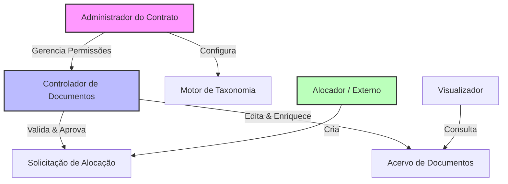

# Visão de Produto: Gerenciador do Ciclo de Vida de Documentos (SAD v2)

Este documento define a evolução da plataforma SAD de uma ferramenta de validação pontual para um **Gerenciador de Ciclo de Vida de Documentos (DLM)** completo, inspirado em interfaces premium (Nestfi, Dashboards Financeiros) e altamente adaptável a diferentes contratos.

## 🎯 Conceito Central
Deixar de ser um "validador de arquivos locais" para se tornar a **Central de Comando** da digitalização e conformidade documental. O "Validador SAD" atual torna-se apenas um módulo dentro deste ecossistema maior.

---

## � Segurança & Isolamento (Multi-Tenancy) 🛡️

A arquitetura do sistema é fundamentada na **Segregação Estrita de Dados**. Garantimos que cada contrato ou empresa opere em um universo completamente isolado.

*   **Silos de Dados (Hard Isolation)**:
    *   Cada Empresa/Contrato possui seu próprio ambiente lógico.
    *   **Absoluta Privacidade**: É tecnicamente impossível que um usuário da "Empresa X" acesse documentos, metadados ou configurações da "Empresa Y".
    *   **Bancos de Dados Segregados**: Seus dados de contrato, usuários e documentos sensíveis são armazenados de forma que não se misturam com dados de outros clientes.
*   **Customização Independente**:
    *   As configurações de Colunas, Taxonomia e Regras definidas pela Empresa X **não afetam** nem são visíveis para a Empresa Y. Cada cliente molda o sistema à sua realidade sem interferência externa.

---

## �👥 Hierarquia de Usuários & Governança

O sistema adota um modelo de **RBAC (Role-Based Access Control)** flexível, onde cada instância (Empresa/Contrato) possui autonomia total.

### Diagrama de Hierarquia

### Definição de Papéis (Roles)

1.  **Administrador (Support/Master)**
    *   *Responsabilidade*: "Dono" da instância do software na empresa.
    *   *Poderes*: Cria e gerencia os demais usuários, define as regras do **Motor de Taxonomia**, cria colunas personalizadas e configura integrações. É o único que pode dar ou revogar permissões.

2.  **Controlador de Documentos (Document Controller)**
    *   *Responsabilidade*: Garantir a qualidade e a veracidade do acervo.
    *   *Poderes*: Valida documentos, aprova/reprova solicitações de alocação, edita metadados, conserta erros de OCR e gera GRDs. É o "power user" operacional.

3.  **Alocador (Solicitante Interno/Externo)**
    *   *Responsabilidade*: Alimentar o sistema com novos inputs.
    *   *Poderes*: Pode criar "Solicitações de Alocação" (Upload preliminar) e acompanhar o status de seus envios. Não pode alterar documentos já aprovados no acervo.

4.  **Visualizador (Viewer/Auditor)**
    *   *Responsabilidade*: Consulta e Auditoria.
    *   *Poderes*: Acesso somente leitura (Read-Only) ao Dashboard e ao Acervo. Pode exportar relatórios, mas não pode alterar dados ou baixar documentos originais (se configurado assim).

---

## 🏗 Arquitetura de Informação & Módulos

### 1. Dashboard "Command Center" (Inspiração: Nestfi)
Visão executiva do fluxo de documentos.
*   **KPIs**: Total Processado, Fila de Sincronização, Taxa de Rejeição, Eficiência.
*   **Gráficos**: Fluxo de Entrada (Diário), Status da Nuvem (Donut).
*   **Ações Rápidas**: "Novo Lote", "Importar Status Externo", "Nova Alocação".

### 2. Módulo de Validação & Organização (O SAD Atual)
O núcleo técnico atual torna-se uma aba ou módulo específico ("Ferramentas de Entrada").
*   **Funcionalidade**: Upload, validação de hash/tamanho e organização em pastas.
*   **Novidade**: Após organização, o sistema solicita/gera o número da **GRD (Guia de Remessa de Documentos)** e vincula aos arquivos processados.

### 3. Registro de Documentos "Registry" (Inspiração: Orders Dashboard)
A "verdade única" e histórica.
*   **Propriedade do Documento**:
    *   Cadastro de **Responsável (Dono)** por documento (Nome/Email).
    *   **Notificações Automáticas**: Se um documento é reprovado ou comentado, o responsável recebe um e-mail com os detalhes das correções necessárias.
*   **Sincronização de Status Externo**:
    *   Capacidade de importar planilhas externas (ex: "Planilha da Fiscalização").
    *   O sistema atualiza automaticamente o status dos documentos (ex: de "Enviado" para "Aprovado" ou "Comentado") cruzando pelo Nome/Código.

### 4. Motor de Flexibilidade & Taxonomia (Novo) 🌟
O sistema deve ser **agnóstico a contratos**, permitindo total customização pelo usuário admin.
*   **Colunas Dinâmicas (Data Grid Customizável)**:
    *   O usuário pode **criar, renomear e excluir colunas** da tabela de registro para se adequar à realidade do contrato.
    *   *Tipos de Controle*:
        *   *Dropdown*: Lista de valores fechada (ex: Disciplinas, Áreas).
        *   *Automático*: Campos travados/read-only autopreenchidos pelo sistema.
        *   *Livre*: Texto ou data.
*   **Motor de Taxonomia (Padrões de Nomenclatura)**:
    *   Configuração de **Máscaras/Regex** por Tipo de Documento.
    *   *Exemplo*: Ao cadastrar o tipo "Certificado (CE)", o sistema exige o formato `CE-{CODIGO}-{ANO}`.
    *   **Associação por Grupo**: Regras específicas para grupos de documentos (ex: "Curriculos" devem seguir padrão X e ter colunas Y e Z obrigatórias).

### 5. Módulo de Alocações (Workflow de Solicitação)
Permite que profissionais de outros setores solicitem "espaço" ou cadastrem documentos preliminares.
*   **Fluxo**:
    1.  *Solicitante*: Envia pedido de alocação (Dados do documento + Arquivo preliminar).
    2.  *Técnico de Documentação*: Recebe notificação na dashboard.
    3.  *Ação*: Aprova (vira documento oficial no acervo) ou Reprova (com motivo).
*   **Controle de Duplicidade**: O sistema bloqueia cadastro de nomes/códigos já existentes no acervo ou em outras solicitações pendentes.

---

## 🚀 Roadmap de Evolução Expandido

### Sprint 4: Persistência & Histórico (Foundation)
*   [ ] Banco de Dados Histórico (SQLite expandido).
*   [ ] Tabela unificada de documentos (para evitar duplicidade).

### Sprint 5: Dashboard Analytics & GRD
*   [ ] Implementação da UI Nestfi.
*   [ ] Módulo de registro de GRD pós-organização.

### Sprint 6: Flexibilidade & Taxonomia (Core Engine)
*   [ ] Editor de Colunas/Schema (Usuário define campos).
*   [ ] Validador de Regex para Taxonomia de arquivos.

### Sprint 7: Controle de Acesso e Usuários (RBAC)
*   [ ] Arquitetura Multi-Tenant (Isolamento de dados).
*   [ ] Implementação da Hierarquia (Admin, Controlador, Alocador, Viewer).

### Sprint 8: Integração Externa & Alocações
*   [ ] Importador de Excel (Fiscalização) para update de status em massa.
*   [ ] Tela de "Solicitação de Alocação" para usuários externos.

---

## 🎨 Diretrizes de UI V2
*   **Estética**: Manter "Deep Swiss / Apple Glass".
*   **Navegação**: Sidebar com: *Dashboard*, *Meus Documentos* (Validação), *Acervo Global*, *Alocações*, *Configurações* (Onde fica a Taxonomia).
