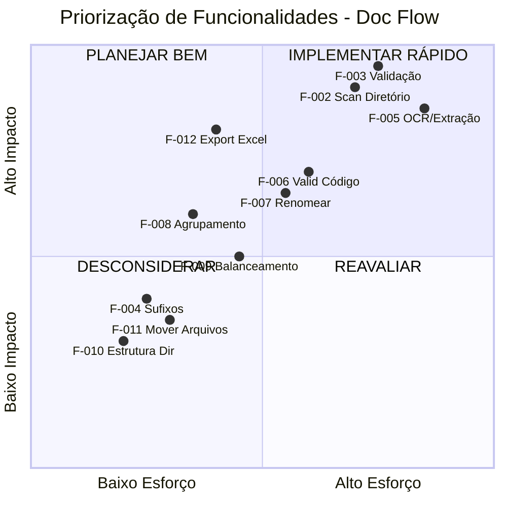

# Matriz de Priorização - Funcionalidades Não Migradas

## 🎯 Matriz Impacto vs Esforço



---

## 📊 Análise por Quadrante

### 🔥 Q1: IMPLEMENTAR RÁPIDO (Alto Impacto, Baixo Esforço)
**Características:** Quick wins, máximo ROI

| ID        | Funcionalidade   | Impacto | Esforço | Justificativa                               |
| --------- | ---------------- | ------- | ------- | ------------------------------------------- |
| **F-012** | Export Excel     | 🔴 Alto  | 🟢 Baixo | Biblioteca pronta (`exceljs`), grande valor |
| **F-008** | Agrupamento Auto | 🟡 Médio | 🟢 Baixo | Lógica simples, melhora UX                  |

**Recomendação:** ⭐ **Começar por aqui** - Entregas rápidas com alto valor percebido

---

### 🎯 Q2: PLANEJAR BEM (Alto Impacto, Alto Esforço)
**Características:** Projetos estratégicos, requerem planejamento

| ID        | Funcionalidade         | Impacto   | Esforço | Justificativa                     |
| --------- | ---------------------- | --------- | ------- | --------------------------------- |
| **F-003** | Validação Automática   | 🔴 Crítico | 🔴 Alto  | Core do sistema, complexo         |
| **F-002** | Scan de Diretório      | 🔴 Crítico | 🔴 Alto  | Upload + processamento assíncrono |
| **F-005** | OCR/Extração Texto     | 🔴 Crítico | 🔴 Alto  | Requer bibliotecas especializadas |
| **F-006** | Validação de Código    | 🟡 Médio   | 🟡 Médio | Depende de F-005                  |
| **F-007** | Renomeação Inteligente | 🟡 Médio   | 🟡 Médio | Depende de F-006                  |

**Recomendação:** 🏗️ **Dividir em sprints** - Atacar por fases com MVP incremental

---

### 🤔 Q3: DESCONSIDERAR (Baixo Impacto, Alto Esforço)
**Características:** Não vale o investimento no momento

| ID        | Funcionalidade | Impacto | Esforço | Observação                      |
| --------- | -------------- | ------- | ------- | ------------------------------- |
| *Nenhuma* | -              | -       | -       | Todas funcionalidades têm valor |

**Observação:** Não há funcionalidades neste quadrante. Todas as features do SAD v2.0 são relevantes.

---

### 💡 Q4: REAVALIAR (Baixo Impacto, Baixo Esforço)
**Características:** Nice to have, implementar se sobrar tempo

| ID        | Funcionalidade       | Impacto       | Esforço | Justificativa                |
| --------- | -------------------- | ------------- | ------- | ---------------------------- |
| **F-004** | Correção Sufixos     | 🟡 Baixo       | 🟢 Baixo | Pode ser manual inicialmente |
| **F-009** | Balanceamento Lotes  | 🟡 Baixo       | 🟢 Médio | Interface manual funciona    |
| **F-010** | Estrutura Diretórios | 🟢 Muito Baixo | 🟢 Baixo | Não aplica a web app         |
| **F-011** | Mover Arquivos       | 🟢 Muito Baixo | 🟢 Baixo | Arquitetura diferente        |

**Recomendação:** ⏳ **Backlog** - Implementar após Q1 e Q2

---

## 🚀 Sequência Recomendada de Implementação

### Fase 1: Foundation (4 semanas)
```
SPRINT 1 → F-002 (Scan/Upload) + F-003 (Validação)
SPRINT 2 → F-012 (Export Excel) + F-008 (Agrupamento)
```

**Resultado:** MVP funcional para validação básica + exportação

---

### Fase 2: Intelligence (3 semanas)
```
SPRINT 3 → F-005 (OCR/Extração)
SPRINT 4 → F-006 + F-007 (Validação + Renomeação)
```

**Resultado:** Automação inteligente para arquivos não reconhecidos

---

### Fase 3: Polish (2 semanas)
```
SPRINT 5 → F-004 (Sufixos) + F-009 (Balanceamento)
SPRINT 6 → Refinamentos + UX improvements
```

**Resultado:** Paridade completa com SAD v2.0

---

## 📈 Métricas de Decisão

### Cálculo de Esforço
| Pontos | Descrição       | Exemplo             |
| ------ | --------------- | ------------------- |
| 1-3    | Baixo - Dias    | F-004, F-008        |
| 4-6    | Médio - Semanas | F-006, F-007, F-009 |
| 7-10   | Alto - Meses    | F-002, F-003, F-005 |

### Cálculo de Impacto
| Nivel     | Critério                      | Exemplo             |
| --------- | ----------------------------- | ------------------- |
| 🔴 Crítico | Sistema não funciona sem      | F-002, F-003, F-005 |
| 🟡 Alto    | Grande melhoria de eficiência | F-012, F-006        |
| 🟢 Médio   | Nice to have                  | F-004, F-008, F-009 |
| ⚪ Baixo   | Opcional                      | F-010, F-011        |

---

## 🎲 Análise de Risco

### Alto Risco (Requer PoC)
- **F-005 (OCR):** Bibliotecas Node.js podem não ter mesma qualidade que PyPDF2
- **F-002 (Upload):** Limites de tamanho e timeout
- **F-003 (Validação):** Performance para lotes grandes (1000+ arquivos)

### Médio Risco
- **F-012 (Excel):** Formatação pode não ser idêntica
- **F-006/007:** Regex patterns podem precisar ajustes

### Baixo Risco
- **F-008, F-009, F-004:** Lógica de negócio simples

---

## 💰 Análise Custo-Benefício

### ROI Alto (Implementar Primeiro)
1. **F-012** - Export Excel (1 semana, alto valor)
2. **F-008** - Agrupamento (3 dias, boa UX)
3. **F-003** - Validação (3 semanas, crítico)

### ROI Médio
4. **F-002** - Scan (3 semanas)
5. **F-005** - OCR (2 semanas)

### ROI Baixo (Apenas se sobrar budget)
6. **F-004, F-009** - Features auxiliares

---

## ✅ Critérios de Aceitação

### Must Have (MVP)
- [x] F-003: Validação automática funcionando
- [x] F-002: Upload de lote completo
- [x] F-012: Exportação de manifesto Excel

### Should Have (v1.0)
- [ ] F-005: OCR para PDFs
- [ ] F-006/007: Resolução automática
- [ ] F-008: Agrupamento inteligente

### Nice to Have (v1.1+)
- [ ] F-004: Correção de sufixos
- [ ] F-009: Balanceamento otimizado

---

**Última atualização:** 03/02/2026  
**Próxima revisão:** Após Sprint 1
